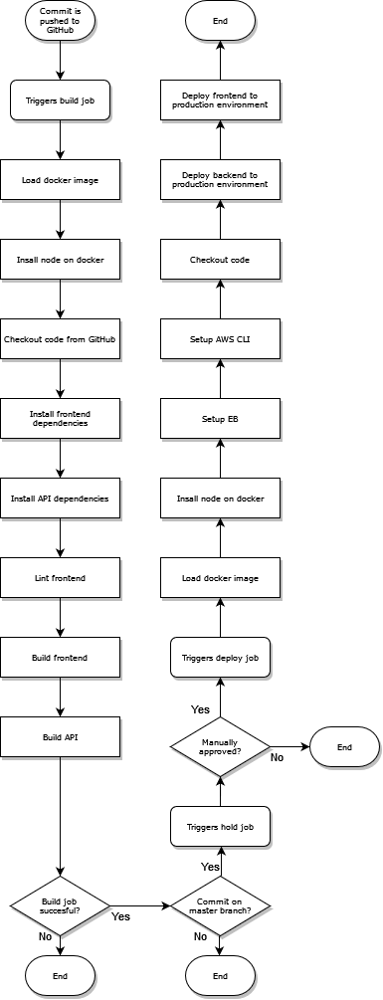

# Pipeline description

## Table of contents

* [Pipeline diagram](#pipeline-diagram)
* [Workflow](#workflow)
* [Jobs](#jobs)
    * [Build](#build)
    * [Hold](#hold)
    * [Deploy](#deploy)

## Pipeline diagram

## Workflow

The pipeline:
1. Builds the code.
2. Checks whether the `build` job was successful and a commit was pushed to the `master` branch.
3. If true the pipeline waits for manual approval to start deployment to AWS production environment.

## Jobs

### Build

The `build` job executes the following steps to build the code:

#### 1. Install Front-End dependencies

1. Change working directory to `udagram-frontend`
2. Install all dependencies from npm forcefully

#### 2. Install API dependencies

1. Change working directory to `udagram-api`
2. Install all dependencies from npm

#### 3. Lint Front-End

1. Change working directory to `udagram-frontend`
2. Use Angualr to lint code (`ng lint`)

#### 4. Build Front-End

1. Change working directory to `udagram-frontend`
2. Use Angular to build code (`ng build`)

#### 5. Build API

1. Change working directory to `udagram-api`
2. Install all dependencies from npm
3. Remove directory `www`
4. Compile TypeScript to JavaScript
5. Copy directory `src/config` to `wwww/config`
6. Copy diretory `.elasticbeanstalk` to `www/.elasticbeanstalk`
7. Copy `.npmrc` to `www/.npmrc`
8. Copy `package.json` to `www/package.json`
9. Change working directory to `www`
10. Zip content of directory `www` into `Archive.zip` and save `Archive.zip` in directory `udagram-api`
11. Change working directory to `udagram-api`

### Hold

The `hold` job pauses the execution of the pipeline until manual approval.
The job is only executed if the previous `build` job was successful and the code changes occured on the `master` branch.

### Deploy

The `deploy` job is only executed if the previous `hold` job was approved manually. The job runs the following steps to deliver code to production environment:

#### Deploy App

First the backend `udagram-api` is deployed to Elastic Beanstalk.
Afterwards `udagram-frontend` is deployed to S3.

Deployment of backend consists of these steps:

1. Change working directory to `udagram-api`
2. Install all dependencies from npm
3. Remove directory `www`
4. Compile TypeScript to JavaScript
5. Copy directory `src/config` to `wwww/config`
6. Copy directory `.elasticbeanstalk` to `www/.elasticbeanstalk`
7. Copy `.npmrc` to `www/.npmrc`
8. Copy `package.json` to `www/package.json`
9. Change working directory to `www`
10. Zip content of directory `www` into `Archive.zip` and save `Archive.zip` in directory `udagram-api`
11. Change working directory to `udagram-api/www`
12. Set the `Udagramapi-env` environment for Elastic Beanstalk to use
13. Use Elastic Beanstalk to deploy zipped directory `www` to Elastic Beanstalk

Deployment of frontend consists of these steps:

1. Change working directory to `udagram-frontend`
2. Install all dependencies forcefully from npm
3. Use Angular to build the code (`ng build`)
4. Grant `deploy.sh` script in directory `bin` right to be executable
5. Execute `deploy.sh` script which will use AWS CLI to copy content of directory `www` to S3 bucket